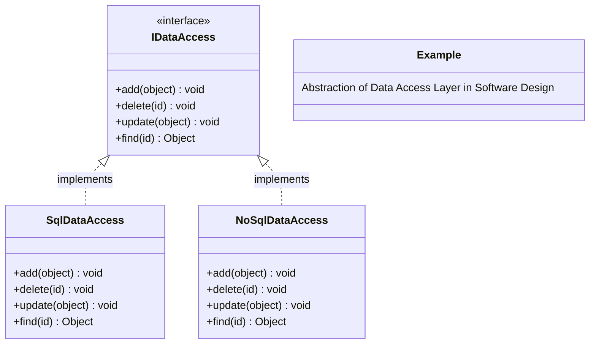
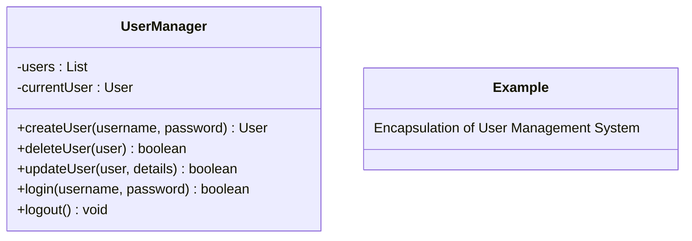
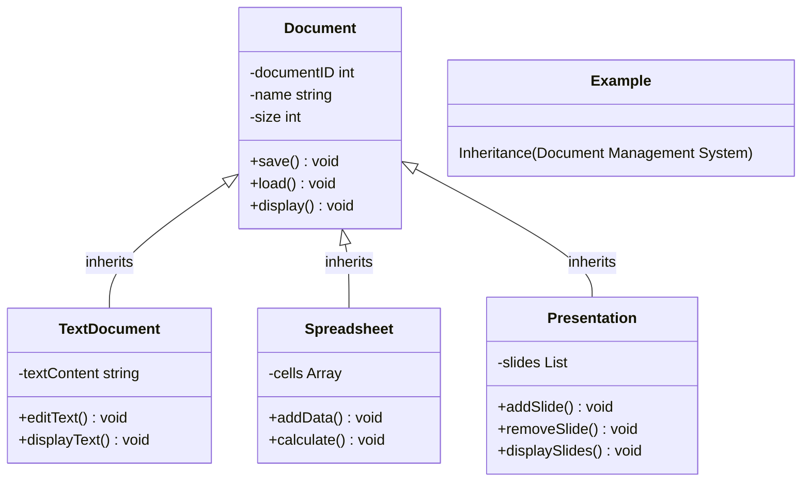
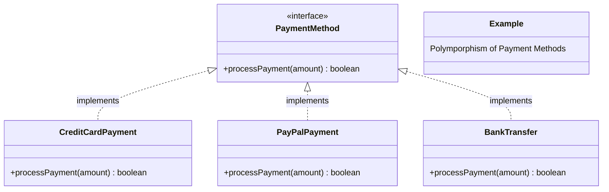

# Introduction to Object-Oriented Design

Below is an article that contains the necessary details for an introduction to object-oriented design. The UML diagrams have been prepared using [Mermaid](https://github.com/mermaid-js/mermaid).

## 1. What is Object-Oriented Design?

### 1.1. Definition
Object-Oriented Design (OOD) involves strategically planning how objects in software will interact to address specific programming challenges. It's about structuring your software using objects that have specific roles and responsibilities.

### 1.2. Difference Between Object-Oriented Design and Object-Oriented Programming
Object-Oriented Design (OOD) and Object-Oriented Programming (OOP) are closely related but distinct concepts. While OOD focuses on the architectural planning of a software system using objects, OOP involves implementing these designs in code. Simply using object-oriented languages and their features like classes and inheritance doesn't guarantee effective OOD. Good design is essential for creating robust and maintainable software.

## 2. Core Concepts in OOD

### 2.1. Class, Interface and Abstract Class
- **Class** A class in object-oriented programming is a blueprint from which individual objects are created. It encapsulates data for the object and methods to manipulate that data. Classes define the properties (data) and behaviors (methods) that their instances (objects) will have.

- **Interface** An interface is a programming structure that defines the methods a class must implement, without providing the implementation itself. Interfaces are used to establish a formal contract that a class agrees to uphold, which means any class that implements the interface agrees to implement all its methods as specified.

- **Abstract Class** An abstract class is a class that cannot be instantiated on its own and must be inherited by other classes. It can include abstract methods (which have no body) that must be implemented by derived classes, as well as concrete methods (which have implementations). This allows abstract classes to define template methods and partial implementations where applicable.

### 2.2. Coupling and Cohesion
- **Coupling** describes how dependent classes or modules are on each other. Lower coupling is preferable because it means that changes in one area of the software have minimal impact on other parts, making the system easier to manage and evolve.
  
- **Cohesion** measures how closely the elements within a single module or class work together to achieve a common goal. A highly cohesive class focuses on a single task, enhancing understandability and reducing complexity.

High coupling combined with low cohesion often leads to fragile and difficult-to-maintain systems. Conversely, striving for low coupling and high cohesion makes software easier to manage, test, and expand.

### 2.2. The Four Pillars of OOD
These principles guide developers in creating flexible, reusable, and maintainable software.

- **Abstraction** allows you to use a class without understanding its intricate details, much like driving a car without knowing the mechanics of its operation. Abstraction helps to reduce complexity and enhance the focus on interaction rather than implementation.

  > **Design Tip:** Keep class members as private or protected as possible to maintain flexibility and cleanliness in your code.

- **Encapsulation**, or data hiding, involves bundling the operations (methods) and data (attributes) of a class together and restricting access to some components. This protects the data and reduces the effects of change.

  > **Design Tip:** Limit visibility to ensure that class internals are exposed only when necessary, which enhances both security and usability.

- **Inheritance** creates a hierarchical relationship between classes, allowing derived classes to inherit features from their base classes, promoting code reuse and reducing redundancy.

  > **Design Tip:** Utilize base classes for common attributes or methods and use protected access to ensure that these are available to subclassed objects.

- **Polymorphism** allows objects to be treated as instances of their parent class, making it possible to use subclasses interchangeably with their base class. This capability is critical for creating flexible and dynamically adaptable software.

  > **Design Tip:** Spend time carefully assigning roles and responsibilities to classes to leverage polymorphism effectively.

With these principles in mind, developers can build software that is robust, easy to maintain, and scalable. Object-oriented design is not just about using specific tools or languages; it's a way of thinking about and structuring your software to address complex problems with efficient solutions.

